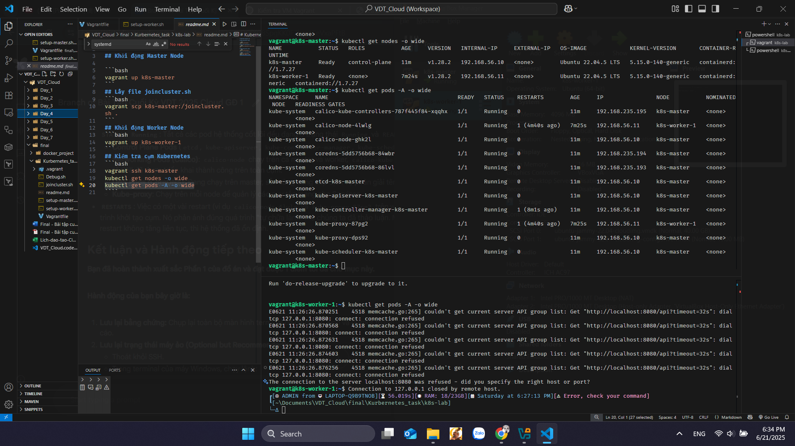
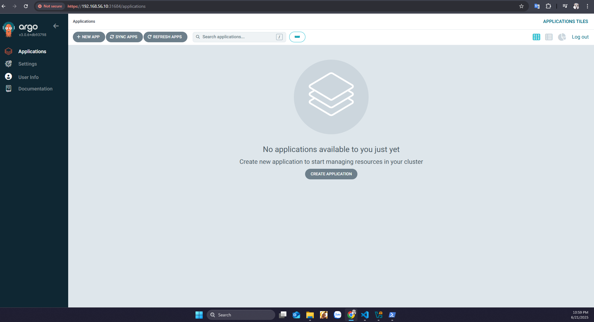
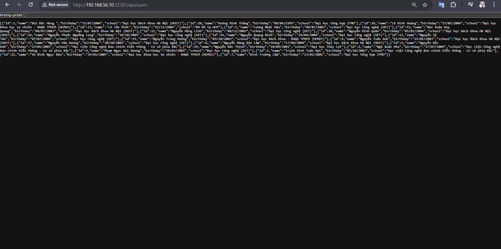

# **Báo cáo Đồ án cuối kỳ VDT 2025 - Cloud GĐ 1**

*   **Họ và tên:** Vũ Đình Ngọc Bảo
*   **Lớp:** Cloud
*   **Mentor:** *

## **I. Giới thiệu tổng quan**

Báo cáo này trình bày quá trình thực hiện bài tập lớn cuối kỳ Giai đoạn 1 của chương trình Viettel Digital Talent 2025, lĩnh vực Cloud. Đồ án tập trung vào việc xây dựng một hệ thống hoàn chỉnh để triển khai, quản lý và giám sát một ứng dụng Cloud Native trên nền tảng Kubernetes.

## **II. Phần 1: Triển khai Hạ tầng Kubernetes (1.0 điểm)**

### **2.1. Tiếp cận và Thực hiện**

Để xây dựng một cụm Kubernetes gồm 1 master và 1 worker, em đã lựa chọn giải pháp sử dụng **`kubeadm`** kết hợp với **Vagrant** và **VirtualBox** để tự động hóa toàn bộ quá trình theo phương pháp Infrastructure as Code. Cách tiếp cận này đảm bảo một môi trường cài đặt nhất quán, ổn định và dễ dàng tái tạo.

Quá trình cài đặt bao gồm các bước chuẩn bị node (tắt swap, cấu hình kernel), cài đặt container runtime là **`containerd`**, và cài đặt các thành phần `kubeadm`, `kubelet`, `kubectl` phiên bản `v1.28.2`. Một cấu hình quan trọng là đảm bảo cả `containerd` và `kubelet` đều sử dụng **`systemd`** làm cgroup driver. Mạng CNI được lựa chọn là **Calico**, kịch bản đã được tùy chỉnh để Calico nhận diện đúng interface mạng private (`enp0s8`).

### **2.2. Kết quả Phần 1**

Cụm Kubernetes đã được khởi tạo thành công và đi vào trạng thái ổn định. Lệnh `kubectl get nodes -o wide` và `kubectl get pods -A -o wide` xác nhận tất cả các node đều `Ready` và các pod hệ thống đều `Running`.

**Trạng thái các Node:**


---

## **III. Phần 2: Triển khai DevOps Tools & Practices**

### **3.1. K8S Helm Chart (Yêu cầu 1: Cài đặt ArgoCD và Jenkins - 1.5 điểm)**

#### **Tiếp cận và Thực hiện**

Các công cụ CI/CD được cài đặt lên cụm Kubernetes bằng **Helm**, trình quản lý gói tiêu chuẩn. Để giải quyết vấn đề lưu trữ dữ liệu bền bỉ cho Jenkins một cách tự động, em đã triển khai **Local Path Provisioner**. Provisioner này sẽ tự động tạo Persistent Volume (PV) khi có yêu cầu từ Persistent Volume Claim (PVC), giúp đơn giản hóa và tự động hóa việc quản lý lưu trữ.

**1. Cài đặt Local Path Provisioner (Tạo StorageClass động):**
```sh
kubectl apply -f https://raw.githubusercontent.com/rancher/local-path-provisioner/master/deploy/local-path-storage.yaml
kubectl patch storageclass local-path -p '{"metadata": {"annotations":{"storageclass.kubernetes.io/is-default-class":"true"}}}'
```

**2. Cài đặt ArgoCD:**
ArgoCD được cài đặt và expose bằng `NodePort` thông qua lệnh Helm.
```sh
helm repo add argo https://argoproj.github.io/argo-helm
helm repo update
kubectl create namespace argocd
helm install argocd argo/argo-cd -n argocd --set server.service.type=NodePort
```

**3. Cài đặt Jenkins:**
Jenkins được cài đặt với file cấu hình `jenkins-values.yaml` riêng để tùy chỉnh các tham số quan trọng, bao gồm việc sử dụng `NodePort`, đặt mật khẩu admin, và tăng thời gian cho Startup Probe để đảm bảo khởi động ổn định trong môi trường tài nguyên hạn chế.

Đảm bảo copy file pv.yaml 
```sh
vagrant scp ..\jenkins-lab\pv.yaml k8s-master:/home/vagrant
```


Sau đó cài đặt jenkins như sau:
```sh
# Lệnh cài đặt Jenkins
helm repo add jenkins https://charts.jenkins.io
helm repo update

kubectl create namespace jenkins
kubectl apply -f ~/pv.yaml
kubectl delete pvc jenkins -n jenkins

helm install jenkins jenkins/jenkins -n jenkins \
  --set controller.startupProbe.enabled=true \
  --set controller.startupProbe.failureThreshold=90 \
  --set controller.startupProbe.periodSeconds=10 \
  --set controller.startupProbe.timeoutSeconds=5 \
  --set controller.resources.requests.memory="1Gi" \
  --set controller.resources.limits.memory="2Gi" \
  --set controller.serviceType=NodePort

```

Check pod, log, note, ip 
```sh 
kubectl get pods -o wide -n jenkins
kubectl get pods -o wide -n argocd

kubectl get svc -n jenkins
kubectl get svc -n argocd

kubectl describe pod jenkins-0 -n jenkins

kubectl get pod -n argocd | grep server
kubectl describe pod argocd-application-controller-0 -n argocd

kubectl logs -f jenkins-0 -n jenkins
kubectl logs -f <argo-server-pod-name> -n argocd

```

Lấy password bằng 
```sh
kubectl get secret jenkins -n jenkins -o jsonpath="{.data.jenkins-admin-password}" | base64 --decode && echo
kubectl -n argocd get secret argocd-initial-admin-secret -o jsonpath="{.data.password}" | base64 -d && echo

```

#### **Kết quả Yêu cầu 1**

Cả ArgoCD và Jenkins đều đã được cài đặt thành công, expose qua NodePort và có thể truy cập từ trình duyệt.

**Giao diện ArgoCD:** 


**Giao diện Jenkins Dashboard:** 


### ** Triển khai helm

### **3.2. K8S Helm Chart & Triển khai Ứng dụng (1.5 điểm)**

#### **Tiếp cận và Thực hiện**

Để đáp ứng yêu cầu triển khai một ứng dụng theo cấu trúc microservices và quản lý nó một cách chuyên nghiệp, em đã thực hiện các bước sau:

1.  **"Helm hóa" ứng dụng:** Toàn bộ ứng dụng 3 thành phần (`backend`, `frontend`, `database`) đã được đóng gói vào một Helm Chart duy nhất. Cách tiếp cận này cho phép quản lý, tùy chỉnh và triển khai toàn bộ ứng dụng bằng một bộ cấu hình tập trung.

2.  **Tách biệt Cấu hình và Source Code (GitOps):** Em đã áp dụng mô hình GitOps bằng cách sử dụng hai repository riêng biệt: một repo cho source code và chart nguồn, và một repo riêng cho các file cấu hình `values.yaml` của môi trường triển khai.

3.  **Triển khai bằng ArgoCD:** Một `Application` manifest đã được tạo để chỉ thị cho ArgoCD tự động lấy chart nguồn và kết hợp nó với file values từ repo cấu hình, sau đó đồng bộ hóa trạng thái mong muốn lên cụm Kubernetes.

#### **Output và Kết quả**

*   **Các Helm Chart sử dụng để triển khai app lên K8S Cluster:**
    *   Toàn bộ mã nguồn của Helm Chart, bao gồm các file template cho `Deployment`, `StatefulSet`, `Service`, `ConfigMap`, và `Secret`, đã được cấu trúc và đẩy lên thư mục `/chart` trong repository ứng dụng tại [app](https://github.com/chuitrai/my_app).

*   **Các file values.yaml trong config repo của app:**
    *   File `values.yaml` chứa các cấu hình tùy chỉnh cho môi trường lab (như image tag, số lượng replica) được quản lý độc lập tại repository cấu hình [app-config](https://github.com/chuitrai/my_app_config).

*   **Manifest của ArgoCD Application:**
    *   File manifest `argocd-application.yaml` đã được tạo và áp dụng lên cụm để định nghĩa ứng dụng `my-final-project`. File này chỉ định rõ nguồn Helm Chart, nguồn file values, và đích đến là namespace `my-final-project-ns`.

*   **Ảnh chụp giao diện màn hình hệ thống ArgoCD trên trình duyệt:**
        
    *   Sau khi áp dụng manifest, ArgoCD đã tự động đồng bộ hóa và triển khai thành công toàn bộ ứng dụng. Giao diện ArgoCD hiển thị trạng thái `Healthy` và `Synced`, xác nhận rằng trạng thái trên cluster khớp với cấu hình trong Git.


*   **Ảnh chụp giao diện màn hình trình duyệt khi truy cập vào Web URL, API URL:**
    *   Ứng dụng đã được triển khai thành công và có thể truy cập từ bên ngoài. Dưới đây là hình ảnh xác nhận Web UI (Frontend) và kết quả trả về từ API (Backend) hoạt động chính xác.

    **Truy cập Web URL (Giao diện Frontend):** 
    


    **Truy cập API URL (Kết quả Backend):**
    


Vì là node thuộc cluster nên dùng ngrok để biến thành public IP, khi đó dùng github webhook để có thể nhận thấy sự thay đổi. Việc cài và chạy ngrok http:// .... để forward đến private IP.


### **3.3. CI/CD - Tự động hóa quy trình triển khai (1.5 điểm)**

#### **Tiếp cận và Nguyên lý hoạt động**

Để đáp ứng yêu cầu tự động hóa hoàn toàn quy trình từ lúc code thay đổi cho đến khi được triển khai, em đã xây dựng một luồng CI/CD dựa trên các nguyên tắc và công cụ DevOps hiện đại. Hướng tiếp cận này tách biệt rõ ràng hai quy trình:

1.  **Continuous Integration (CI):** Được chủ trì bởi **Jenkins**. Nhiệm vụ của CI là lắng nghe các thay đổi trong source code, sau đó tự động build, kiểm thử (trong tương lai), và đóng gói ứng dụng thành một "hiện vật" (artifact) sẵn sàng để triển khai. Trong đồ án này, "hiện vật" chính là một Docker image được phiên bản hóa và đẩy lên Docker Hub.

2.  **Continuous Deployment (CD):** Được chủ trì bởi **ArgoCD** theo mô hình **GitOps**. Thay vì Jenkins trực tiếp can thiệp vào cụm Kubernetes, pipeline CI chỉ có một nhiệm vụ cuối cùng là cập nhật "trạng thái mong muốn" trong một repository Git cấu hình riêng. ArgoCD, với vai trò là "operator" trong cụm, sẽ phát hiện sự thay đổi này và tự động "hòa giải" (reconcile) trạng thái của cụm cho khớp với những gì đã được khai báo trong Git.

Sự kết hợp này tạo ra một luồng công việc mạnh mẽ, an toàn và dễ kiểm soát:
*   **Git là nguồn chân lý duy nhất (Single Source of Truth):** Mọi thay đổi trên hệ thống đều phải được ghi nhận bằng một `git commit`, giúp việc truy vết, kiểm toán và rollback trở nên dễ dàng.
*   **Tách biệt vai trò:** Jenkins lo việc "xây dựng", ArgoCD lo việc "triển khai", mỗi công cụ làm đúng vai trò và thế mạnh của mình.
*   **Bảo mật:** Jenkins không cần credential để truy cập trực tiếp vào Kubernetes API, giảm thiểu rủi ro bảo mật.

#### **Các bước thực hiện và Cấu hình chính**

Luồng CI/CD được xây dựng cho service `backend` và có thể áp dụng tương tự cho `frontend`.

đoạn lệnh cài lại docker
```sh
# Gỡ sạch nếu đã cài sai trước đó
sudo apt purge -y docker docker.io docker-doc docker-compose podman-docker containerd containerd.io docker-ce docker-ce-cli
sudo rm -rf /var/lib/docker /etc/docker /run/docker.sock /etc/systemd/system/docker.service.d
sudo rm -f /etc/apt/sources.list.d/docker.list
sudo apt autoremove -y
sudo apt update

# Cài các gói phụ trợ
sudo apt install -y ca-certificates curl gnupg lsb-release

# Thêm Docker GPG key và repo chính thức
sudo install -m 0755 -d /etc/apt/keyrings
curl -fsSL https://download.docker.com/linux/ubuntu/gpg \
 | sudo gpg --dearmor -o /etc/apt/keyrings/docker.gpg

echo \
"deb [arch=$(dpkg --print-architecture) signed-by=/etc/apt/keyrings/docker.gpg] \
https://download.docker.com/linux/ubuntu $(lsb_release -cs) stable" \
| sudo tee /etc/apt/sources.list.d/docker.list > /dev/null

# Cập nhật & cài Docker
sudo apt update
sudo apt install -y docker-ce docker-ce-cli containerd.io

# Bật và khởi động Docker
sudo systemctl enable docker
sudo systemctl start docker
```

1.  **Chuẩn bị môi trường Jenkins:**
    *   Các plugin cần thiết như `Docker Pipeline` và `GitHub Integration` đã được cài đặt.
    *   Credentials đã được tạo và lưu trữ an toàn trong Jenkins, bao gồm:
        *   Credential cho Docker Hub (để `push` image).
        *   Credential cho GitHub (sử dụng Personal Access Token với quyền `repo` để `push` vào repo cấu hình).

2.  **Xây dựng Pipeline as Code với `Jenkinsfile`:**
    *   Toàn bộ logic của pipeline được định nghĩa trong file `Jenkinsfile` và lưu trữ cùng với source code.
    *   **Agent Configuration:** Pipeline được cấu hình để chạy trên một **Pod Agent động** được tạo ra bởi Kubernetes Plugin. Pod agent này được tùy chỉnh để chứa cả container `jnlp` (để kết nối với Jenkins) và container `docker` (chứa các công cụ cần thiết như Docker CLI, Git, Sed), giải quyết triệt để vấn đề về môi trường build không tương thích.
    *   **Các giai đoạn (Stages) của pipeline:**
        1.  **Setup Environment:** Checkout source code và cài đặt các công cụ cần thiết (`git`, `sed`) vào môi trường agent.
        2.  **Build and Push Docker Image:** Tự động build một Docker image mới từ `Dockerfile` của backend. Image được gắn một tag duy nhất dựa trên số lần build của Jenkins (ví dụ: `v1.0.x`) để đảm bảo khả năng truy vết. Sau đó, image này được đẩy lên Docker Hub.
        3.  **Update Configuration:** Pipeline tự động clone repository cấu hình (`my_app_config`), sử dụng lệnh `sed` để tìm và cập nhật giá trị `image.tag` trong file `values.yaml`, sau đó commit và push thay đổi này trở lại repository.

3.  **Kích hoạt tự động (Trigger):**
    *   Một webhook đã được cấu hình trên repository ứng dụng (`my_app`). Mỗi khi có một `git push` mới lên nhánh chính, GitHub sẽ tự động gửi tín hiệu đến Jenkins để kích hoạt pipeline.

#### **Output và Kết quả**

*   **Các file setup công cụ của luồng CI/CD (`Jenkinsfile`):**
    *   Toàn bộ định nghĩa pipeline được chứa trong file `Jenkinsfile`, nằm tại thư mục gốc của repository ứng dụng.

*   **Log và Giao diện Pipeline:**
    *   Dưới đây là hình ảnh giao diện Stage View của Jenkins, cho thấy một luồng pipeline đã chạy thành công qua tất cả các giai đoạn, từ build, push đến cập nhật cấu hình. Log chi tiết của quá trình build và push cũng đã được ghi nhận.

    *(Dán ảnh chụp màn hình giao diện Stage View của Jenkins vào đây)*

*   **ArgoCD phát hiện và đồng bộ thay đổi:**
    *   Sau khi Jenkins push thay đổi vào repo cấu hình, ArgoCD đã ngay lập tức phát hiện trạng thái `OutOfSync`. Giao diện `diff` của ArgoCD cho thấy rõ sự thay đổi trong `image.tag` của Deployment backend.
    *   Với chính sách `automated sync`, ArgoCD đã tự động triển khai phiên bản mới.

    *(Dán ảnh chụp màn hình giao diện diff của ArgoCD vào đây)*

*   **Hình ảnh ứng dụng trước và sau khi cập nhật:**
    *   Kết quả cuối cùng là phiên bản mới của ứng dụng đã được triển khai lên cụm Kubernetes một cách tự động và liền mạch, được xác nhận qua việc truy cập lại vào Web/API URL.

    *(Dán ảnh chụp màn hình ứng dụng sau khi đã được pipeline tự động cập nhật)*