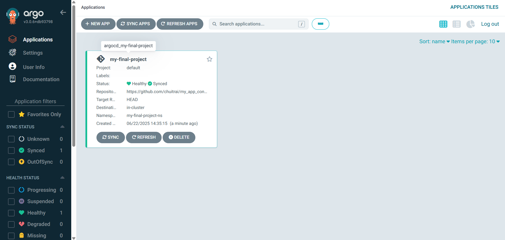
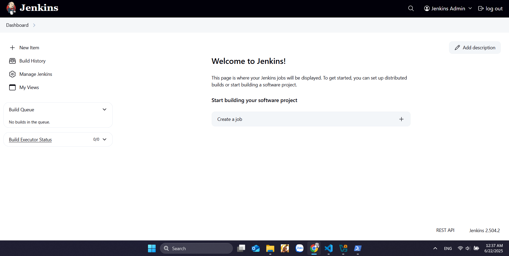
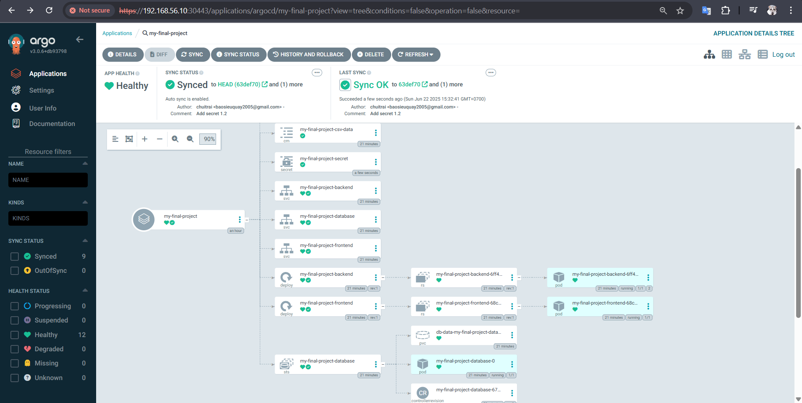
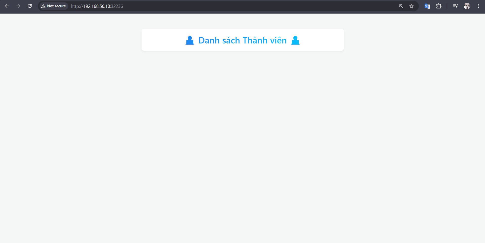
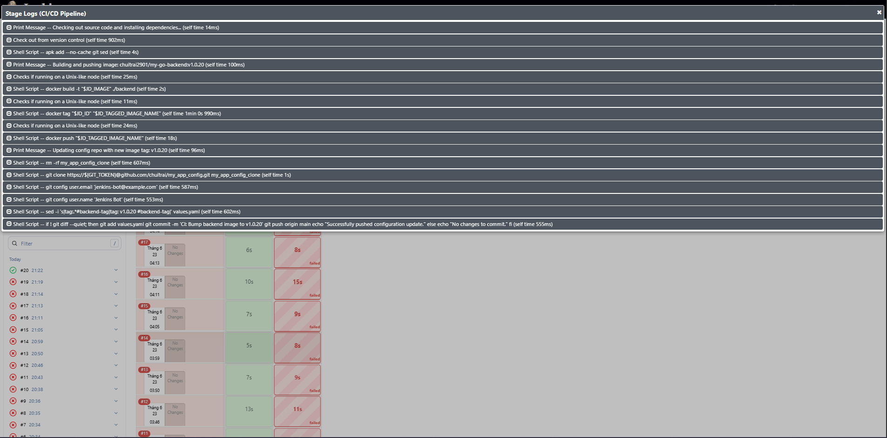
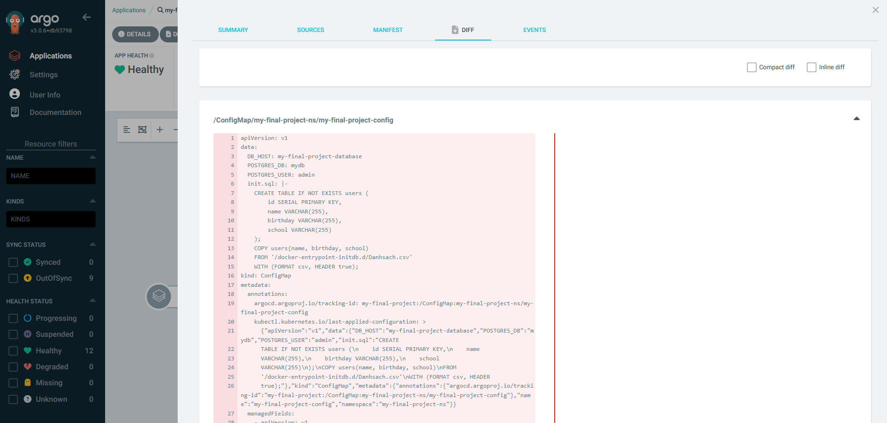
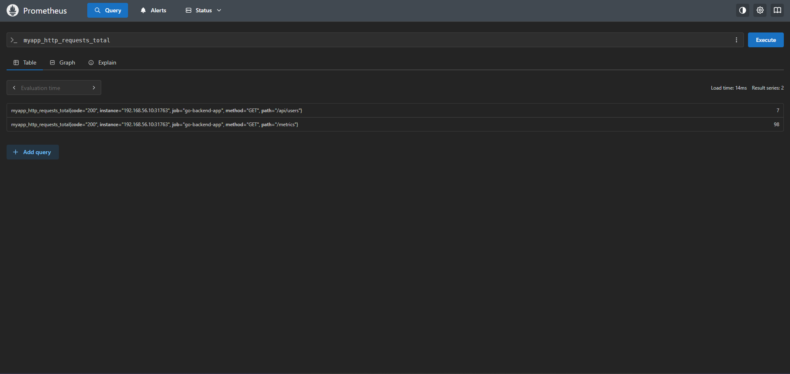
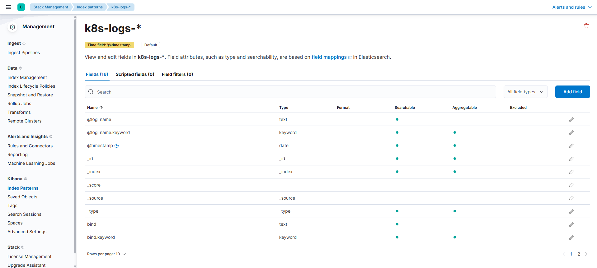

# **Viettel Digital Talent 2025 - Cloud Track**

## **I. Overview**

This report documents the final project for Phase 1 of the Viettel Digital Talent 2025 program (Cloud track). The project's objective was to design, implement, and manage a complete end-to-end system for deploying and monitoring a cloud-native application on the Kubernetes platform, leveraging modern DevOps tools and practices.

## **II. Kubernetes Infrastructure Deployment**

### **2.1. Approach and Implementation**

To establish a baseline Kubernetes cluster (1 master, 1 worker), an Infrastructure as Code (IaC) approach was adopted using **Vagrant** and **VirtualBox** to automate the entire provisioning process. This methodology ensures a consistent, stable, and easily reproducible environment.

The cluster was bootstrapped using **`kubeadm`** (v1.28.2). Key configuration steps included:
-   **Node Preparation:** Disabling swap, configuring kernel parameters (`br_netfilter`), and ensuring network connectivity.
-   **Container Runtime:** Installing and configuring **`containerd`** as the container runtime.
-   **Cgroup Driver:** Standardizing on **`systemd`** as the cgroup driver for both `containerd` and `kubelet` to prevent system instability.
-   **Network CNI:** Implementing **Calico** as the Container Network Interface (CNI), with custom scripts to ensure it correctly identified the private network interface (`enp0s8`) for pod-to-pod communication.

### **2.2. Result**

The Kubernetes cluster was successfully initialized and all components reached a stable, `Ready` state. System pods, including those for Calico CNI, CoreDNS, and the Kubernetes control plane, were confirmed to be `Running`.

**Cluster Node Status:**

---

## **III. DevOps Toolchain & Application Lifecycle Management**

### **3.1. CI/CD Tool Installation with Helm**

#### **Approach and Implementation**

Core DevOps tools were deployed onto the cluster using **Helm**, the standard Kubernetes package manager.

-   **Persistent Storage:** To address the need for stateful applications like Jenkins, **Local Path Provisioner** was deployed. This provisioner dynamically creates Persistent Volumes (PVs) from host paths in response to Persistent Volume Claims (PVCs), automating storage management.

-   **ArgoCD Installation:** The ArgoCD controller and server were installed via its official Helm chart into a dedicated `argocd` namespace. The service was exposed using a `NodePort` for external access.

-   **Jenkins Installation:** Jenkins was installed using a custom `jenkins-values.yaml` file. Key customizations included exposing the service via `NodePort`, setting a default admin password, and significantly increasing the `startupProbe` failure threshold. This last adjustment was critical to ensure Jenkins could start reliably on a resource-constrained virtual environment.

#### **Result**

Both ArgoCD and Jenkins were successfully deployed and became accessible through their respective `NodePort`s from a web browser.

**ArgoCD UI:**

**Jenkins Dashboard:**

### **3.2. Application "Helmification" and GitOps Deployment**

#### **Approach and Implementation**

A three-tier microservices application (backend, frontend, database) was packaged for deployment using the following principles:

1.  **Helm Chart Encapsulation:** The entire application was "Helmified" into a single parent chart. This approach centralizes the management of all components (`Deployment`, `StatefulSet`, `Service`, `ConfigMap`, etc.) and allows for unified, version-controlled releases.

2.  **GitOps with Separated Repositories:** A core GitOps methodology was implemented by maintaining two distinct Git repositories:
    -   **Application Source Repo:** Contains the application source code and the source Helm chart. ([Link to App Repo](https://github.com/chuitrai/my_app))
    -   **Configuration Repo:** Contains only the environment-specific `values.yaml` files. This separation allows infrastructure and application configurations to evolve independently of the application code. ([Link to Config Repo](https://github.com/chuitrai/my_app_config))

3.  **ArgoCD Application Manifest:** An ArgoCD `Application` manifest was created to declaratively define the desired state. This manifest instructs ArgoCD to fetch the source chart from the application repo, apply the configuration from the `values.yaml` in the config repo, and synchronize the resulting state to the target Kubernetes cluster.

#### **Result**

-   **ArgoCD Synchronization:** Upon applying the manifest, ArgoCD successfully pulled the configurations, deployed all application components, and achieved a `Healthy` and `Synced` state, confirming the cluster's live state matched the desired state in Git.
    

-   **Application Accessibility:** The application was successfully deployed and exposed. The frontend UI was accessible, and the backend API responded correctly, validating the end-to-end deployment. For webhook integration from the public internet (GitHub), **`ngrok`** was used to expose the internal Jenkins service endpoint.
    **Web UI (Frontend):**
    
    **API Response (Backend):**
    

### **3.3. CI/CD Pipeline Automation**

#### **Approach and Principles**

A fully automated CI/CD pipeline was constructed based on a clear separation of concerns:

1.  **Continuous Integration (CI) - Managed by Jenkins:** The CI process is triggered by code changes. Its sole responsibilities are to build, test (future scope), and package the application into a versioned Docker image, which is then pushed to a container registry (Docker Hub).

2.  **Continuous Deployment (CD) - Managed by ArgoCD (GitOps):** The Jenkins pipeline does **not** interact directly with the Kubernetes cluster. Instead, its final step is to update the desired application version (image tag) in the **configuration repository**. ArgoCD, acting as an operator within the cluster, detects this change in the Git repository and automatically reconciles the cluster's state to match the new configuration.

This pull-based GitOps model provides significant benefits:
-   **Git as a Single Source of Truth:** All changes are auditable and traceable via `git commit` history.
-   **Enhanced Security:** Jenkins does not require direct `kubectl` access credentials to the production cluster.
-   **Separation of Roles:** Jenkins handles the "build," while ArgoCD handles the "deploy."

#### **Implementation Details**

1.  **Jenkins Environment:** The pipeline was configured to use the **Kubernetes Plugin**, which dynamically provisions ephemeral **Pod Agents** for each build. This pod was defined with two containers: the standard `jnlp` agent and a `docker` container, providing a clean, isolated environment with all necessary tools (Git, Docker CLI, `sed`).

2.  **Pipeline as Code (`Jenkinsfile`):** The entire CI logic was defined in a `Jenkinsfile` stored alongside the application source code. The pipeline consists of the following stages:
    -   **Checkout & Setup:** Clones the source code.
    -   **Build & Push Docker Image:** Builds a new Docker image and tags it with a unique version (e.g., `v1.0.${BUILD_NUMBER}`).
    -   **Update Configuration:** Clones the configuration repository, uses `sed` to update the `image.tag` in the `values.yaml` file, and pushes the change back to the config repo.

3.  **Automation Trigger:** A **GitHub webhook** was configured to automatically trigger the Jenkins pipeline upon a `git push` to the main branch of the application repository.

#### **Result**

The CI/CD pipeline functioned seamlessly. A code change triggered the Jenkins pipeline, which successfully built and pushed a new image. The subsequent commit to the config repo was detected by ArgoCD, which then automatically rolled out the new version to the cluster without any manual intervention.

**Jenkins Pipeline Stage View:**

**ArgoCD Detecting and Diffing the Change:**

### **3.4. Application Monitoring with Prometheus**

#### **Approach and Implementation**

To gain visibility into the application's performance, a monitoring solution was implemented.

-   **Instrumentation:** The backend Go application was instrumented using the official **Prometheus Go client library**. Custom metrics (e.g., HTTP request counters) were exposed via a standard `/metrics` endpoint.

-   **Deployment:** Rather than deploying the entire Prometheus Operator stack, a lightweight approach was taken as per the project requirements. An **Ansible Playbook** was created to deploy a single, standalone **Prometheus container** directly onto the master node.

-   **Challenge & Resolution:** The initial playbook execution failed because the target virtual machine lacked the necessary **Python Docker SDK**. The issue was resolved by adding a task to the playbook to install the `docker` Python library via `pip`. Once the dependency was met, the playbook ran successfully.

-   **Configuration:** The `prometheus.yml` configuration file was configured to scrape the `/metrics` endpoint of the backend service. It targeted the service's stable **`ClusterIP`**, ensuring a reliable internal connection for metric collection.

#### **Result**

Prometheus was successfully deployed and configured. It began scraping metrics from the application pods, and the targets appeared as "UP" in the Prometheus UI, confirming that the monitoring pipeline was operational.

**Prometheus Targets UI:**

### **3.5. Centralized Logging with the EFK Stack**

#### **Approach and Implementation**

For centralized log management and analysis, the **EFK Stack** (Elasticsearch, Fluentd, Kibana) was deployed.

-   **Deployment:** An **Ansible Playbook** was developed to orchestrate the deployment of Elasticsearch (as a `StatefulSet`), Fluentd (as a `DaemonSet`), and Kibana (as a `Deployment`) onto the Kubernetes cluster.

-   **Challenge & Resolution: The "JSON-in-JSON" Problem:** The primary challenge was correctly parsing the structured JSON logs produced by the Go application. By default, Docker and Fluentd wrap the application's entire log line inside a single `log` field, resulting in a nested JSON string (e.g., `{"log": "{\"level\":\"info\",\"method\":\"GET\",\"path\":\"/api/data\"}"}`). This prevented Kibana from indexing the inner fields (`level`, `method`, `path`).

    After inspecting Fluentd's own logs, the solution was identified: a **`parser` filter** needed to be added to the `fluent.conf` configuration. This filter instructs Fluentd to process the content of the `log` field, parse it as JSON, and promote the nested key-value pairs to top-level fields in the final document sent to Elasticsearch.

-   **Final Configuration:** The Fluentd `DaemonSet` was redeployed with the updated `fluent.conf` containing the parser filter.

#### **Result**

After redeploying Fluentd and refreshing the index pattern in Kibana, the logs were correctly parsed. The custom application fields (`level`, `method`, `path`, etc.) appeared as distinct, searchable fields in the Kibana Discover interface, enabling powerful, field-based querying and filtering as required.

**Kibana Discover UI with Parsed Log Fields:**
